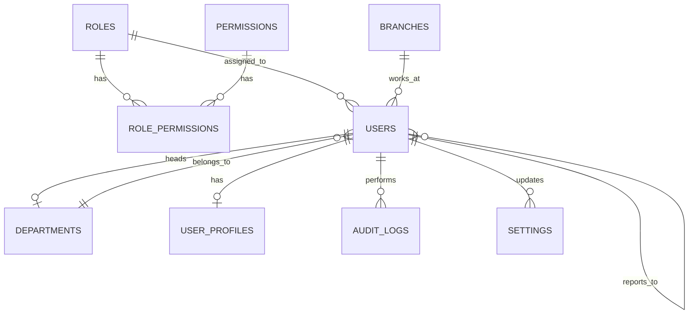

# Phase 1 — Foundation (Core Identity) Database Design Document

**Project:** Amplivo Digital Growth Pvt Ltd — Agency ERP + Corporate Website + Client Portal
**Database:** PostgreSQL (Supabase)
**Scope:** Core identity layer only — roles, permissions, users, org structure, settings, audit. No CRM, campaign, or CMS tables in this phase.

---

## 1. Design Decisions (from PRD)

- **Auth**: Supabase `auth.users` is the source of truth for credentials/JWT. Our `users` table is a 1:1 profile/authorization extension of it (`users.id = auth.users.id`).
- **Two user populations, one table**: PRD requires both an Agency ERP (internal staff: strategists, SEO specialists, designers, account managers, etc.) and a Client Portal (external client logins). Both are represented in `users`, distinguished by `user_type`. Client-side users are **not** linked to a client company yet — that FK (`client_contacts.user_id`) is added in Phase 2 once `clients` exists. Do not add a `client_id` column to `users` now.
- **Multi-branch**: HQ in Hyderabad, branches in Bengaluru, Mumbai, Chennai, Pune, and a Dubai sales office — modeled as `branches`, not hardcoded.
- **RBAC, not hardcoded roles**: PRD lists ~15 internal job roles (Strategist, SEO Specialist, Performance Marketer, Campaign Manager, Account Manager, etc.) plus Admin/Client. These are seed data in `roles`, not enum values, so new roles can be added without a schema change.
- **Permissions are granular and additive**: future phases (CRM, campaigns, invoices, CMS) will keep inserting new rows into `permissions` — the table is designed to accept that without migration.
- **Circular FK**: `departments.head_user_id` → `users.id` and `users.department_id` → `departments.id` are mutually dependent. Resolved by creating `departments` first without `head_user_id`, then `users`, then `ALTER TABLE departments ADD COLUMN head_user_id ...` (see §6 migration order).

---

## 2. Enums

```sql
CREATE TYPE user_type_enum AS ENUM ('internal', 'client');
CREATE TYPE user_status_enum AS ENUM ('pending', 'active', 'inactive', 'suspended');
```

`audit_logs.action` and `entity_type` are deliberately **TEXT, not enum** — every future phase (leads, campaigns, invoices, CMS...) will log against entity types that don't exist yet. Enumerating them now would require a migration per phase.

---

## 3. Tables

### 3.1 `roles`

| Column | Type | Constraints | Notes |
|---|---|---|---|
| id | UUID | PK, default `gen_random_uuid()` | |
| name | TEXT | NOT NULL, UNIQUE | e.g. "Account Manager" |
| slug | TEXT | NOT NULL, UNIQUE | e.g. `account_manager` |
| description | TEXT | | |
| is_system | BOOLEAN | NOT NULL, DEFAULT false | true for Super Admin/Admin/Client — blocks deletion in app logic |
| created_at | TIMESTAMPTZ | NOT NULL, DEFAULT now() | |
| updated_at | TIMESTAMPTZ | NOT NULL, DEFAULT now() | |

### 3.2 `permissions`

| Column | Type | Constraints | Notes |
|---|---|---|---|
| id | UUID | PK, default `gen_random_uuid()` | |
| module | TEXT | NOT NULL | e.g. `campaigns`, `leads`, `invoices`, `seo` |
| action | TEXT | NOT NULL | e.g. `create`, `read`, `update`, `delete`, `approve`, `export` |
| slug | TEXT | NOT NULL, UNIQUE | generated `module.action`, e.g. `campaigns.approve` |
| description | TEXT | | |
| created_at | TIMESTAMPTZ | NOT NULL, DEFAULT now() | |

`UNIQUE (module, action)`

### 3.3 `role_permissions` (junction)

| Column | Type | Constraints |
|---|---|---|
| role_id | UUID | FK → roles.id, ON DELETE CASCADE |
| permission_id | UUID | FK → permissions.id, ON DELETE CASCADE |
| granted_at | TIMESTAMPTZ | NOT NULL, DEFAULT now() |

`PRIMARY KEY (role_id, permission_id)`

### 3.4 `branches`

| Column | Type | Constraints | Notes |
|---|---|---|---|
| id | UUID | PK, default `gen_random_uuid()` | |
| name | TEXT | NOT NULL | e.g. "Hyderabad HQ" |
| code | TEXT | NOT NULL, UNIQUE | e.g. `HYD-HQ`, `BLR`, `DXB` |
| city | TEXT | NOT NULL | |
| state | TEXT | | |
| country | TEXT | NOT NULL | |
| address | TEXT | | |
| phone | TEXT | | |
| email | TEXT | | |
| is_headquarters | BOOLEAN | NOT NULL, DEFAULT false | true only for Hyderabad |
| is_sales_office | BOOLEAN | NOT NULL, DEFAULT false | true for Dubai per PRD |
| timezone | TEXT | NOT NULL, DEFAULT `'Asia/Kolkata'` | Dubai branch overrides to `Asia/Dubai` |
| is_active | BOOLEAN | NOT NULL, DEFAULT true | |
| created_at | TIMESTAMPTZ | NOT NULL, DEFAULT now() | |
| updated_at | TIMESTAMPTZ | NOT NULL, DEFAULT now() | |

### 3.5 `departments`

| Column | Type | Constraints | Notes |
|---|---|---|---|
| id | UUID | PK, default `gen_random_uuid()` | |
| name | TEXT | NOT NULL, UNIQUE | e.g. "SEO", "Performance Marketing", "Creative & Design" |
| slug | TEXT | NOT NULL, UNIQUE | |
| description | TEXT | | |
| head_user_id | UUID | FK → users.id, ON DELETE SET NULL, **added after `users` exists** | department head |
| created_at | TIMESTAMPTZ | NOT NULL, DEFAULT now() | |
| updated_at | TIMESTAMPTZ | NOT NULL, DEFAULT now() | |

### 3.6 `users`

| Column | Type | Constraints | Notes |
|---|---|---|---|
| id | UUID | PK, FK → `auth.users.id`, ON DELETE CASCADE | not a generated default — must equal the Supabase auth user id |
| email | TEXT | NOT NULL, UNIQUE | mirrors auth.users.email for querying convenience |
| phone | TEXT | | |
| user_type | user_type_enum | NOT NULL, DEFAULT `'internal'` | `internal` = agency staff/admin, `client` = client portal login |
| role_id | UUID | NOT NULL, FK → roles.id, ON DELETE RESTRICT | |
| department_id | UUID | FK → departments.id, ON DELETE SET NULL | NULL for client-type users |
| branch_id | UUID | FK → branches.id, ON DELETE SET NULL | NULL for client-type users |
| reporting_manager_id | UUID | FK → users.id, ON DELETE SET NULL | self-referencing, org hierarchy |
| status | user_status_enum | NOT NULL, DEFAULT `'pending'` | |
| last_login_at | TIMESTAMPTZ | | |
| created_at | TIMESTAMPTZ | NOT NULL, DEFAULT now() | |
| updated_at | TIMESTAMPTZ | NOT NULL, DEFAULT now() | |

Application-level check (not a DB constraint, since Postgres CHECK can't easily cross-validate cleanly here): if `user_type = 'client'`, `department_id` and `branch_id` should be NULL — enforce in API layer or a `CHECK` trigger if desired later.

### 3.7 `user_profiles`

| Column | Type | Constraints | Notes |
|---|---|---|---|
| user_id | UUID | PK, FK → users.id, ON DELETE CASCADE | 1:1 with users |
| full_name | TEXT | NOT NULL | |
| avatar_url | TEXT | | |
| designation | TEXT | | job title, e.g. "SEO Specialist" — free text, distinct from `roles.name` (permissions role) |
| bio | TEXT | | |
| gender | TEXT | | |
| date_of_birth | DATE | | |
| date_of_joining | DATE | | internal staff only |
| timezone | TEXT | NOT NULL, DEFAULT `'Asia/Kolkata'` | |
| linkedin_url | TEXT | | |
| emergency_contact_name | TEXT | | |
| emergency_contact_phone | TEXT | | |
| address | TEXT | | |
| created_at | TIMESTAMPTZ | NOT NULL, DEFAULT now() | |
| updated_at | TIMESTAMPTZ | NOT NULL, DEFAULT now() | |

### 3.8 `settings`

| Column | Type | Constraints | Notes |
|---|---|---|---|
| id | UUID | PK, default `gen_random_uuid()` | |
| key | TEXT | NOT NULL, UNIQUE | e.g. `company.legal_name`, `branding.primary_color`, `email.smtp_host` |
| value | JSONB | NOT NULL | |
| category | TEXT | NOT NULL | e.g. `general`, `branding`, `email`, `integration` |
| is_public | BOOLEAN | NOT NULL, DEFAULT false | true = safe to expose to the public website/frontend (e.g. taglines, brand colors) |
| description | TEXT | | |
| updated_by | UUID | FK → users.id, ON DELETE SET NULL | |
| created_at | TIMESTAMPTZ | NOT NULL, DEFAULT now() | |
| updated_at | TIMESTAMPTZ | NOT NULL, DEFAULT now() | |

Used to store company profile fields from the PRD (legal name, brand name, taglines, verified business stats, brand colors/typography tokens) without hardcoding them into frontend code.

### 3.9 `audit_logs`

| Column | Type | Constraints | Notes |
|---|---|---|---|
| id | UUID | PK, default `gen_random_uuid()` | |
| user_id | UUID | FK → users.id, ON DELETE SET NULL | NULL for system-initiated actions |
| action | TEXT | NOT NULL | `create`, `update`, `delete`, `login`, `logout`, `approve`, `reject`, ... |
| entity_type | TEXT | NOT NULL | e.g. `campaign`, `lead`, `invoice`, `creative_asset` — future-phase entities, intentionally not FK'd |
| entity_id | UUID | | |
| old_values | JSONB | | |
| new_values | JSONB | | |
| ip_address | INET | | |
| user_agent | TEXT | | |
| created_at | TIMESTAMPTZ | NOT NULL, DEFAULT now() | |

---

## 4. Relationship Diagram



---

## 5. Indexes

```sql
CREATE INDEX idx_users_role_id ON users(role_id);
CREATE INDEX idx_users_department_id ON users(department_id);
CREATE INDEX idx_users_branch_id ON users(branch_id);
CREATE INDEX idx_users_reporting_manager_id ON users(reporting_manager_id);
CREATE INDEX idx_users_user_type ON users(user_type);
CREATE INDEX idx_users_status ON users(status);

CREATE INDEX idx_role_permissions_permission_id ON role_permissions(permission_id);

CREATE INDEX idx_audit_logs_user_id ON audit_logs(user_id);
CREATE INDEX idx_audit_logs_entity ON audit_logs(entity_type, entity_id);
CREATE INDEX idx_audit_logs_created_at ON audit_logs(created_at DESC);

CREATE INDEX idx_settings_category ON settings(category);
```

---

## 6. Migration Order (resolves the departments/users circular FK)

1. Enums (`user_type_enum`, `user_status_enum`)
2. `roles`
3. `permissions`
4. `role_permissions`
5. `branches`
6. `departments` (without `head_user_id`)
7. `users` (references `roles`, `departments`, `branches`, self)
8. `user_profiles`
9. `ALTER TABLE departments ADD COLUMN head_user_id UUID REFERENCES users(id) ON DELETE SET NULL;`
10. `settings`
11. `audit_logs`

---

## 7. Row-Level Security Strategy

All tables get `ENABLE ROW LEVEL SECURITY`. Pattern used throughout (and reused in every later phase):

- A `SECURITY DEFINER` helper function `auth_user_role_slug()` reads the caller's `role_id` from `users` via `auth.uid()`.
- A helper `auth_has_permission(perm_slug TEXT)` joins `users → role_permissions → permissions` for the caller.
- **users / user_profiles**: caller can `SELECT`/`UPDATE` their own row; `auth_has_permission('users.read')` / `('users.update')` grants staff-wide access.
- **roles / permissions / role_permissions**: read-only for all authenticated internal users; write requires `auth_has_permission('roles.manage')` (Super Admin/Admin only).
- **departments / branches**: public-readable to internal users; write requires `auth_has_permission('org.manage')`.
- **settings**: rows with `is_public = true` are readable by anon/public (for the corporate website); everything else requires `auth_has_permission('settings.manage')`.
- **audit_logs**: insert-only via backend service role; read requires `auth_has_permission('audit.read')`. No client-side update/delete ever.

---

## 8. Seed Data Plan

**Roles** (`is_system = true` for the first three):
`super_admin`, `admin`, `client`, plus one per PRD job title: `account_manager`, `campaign_manager`, `sales_executive`, `client_success_manager`, `seo_specialist`, `performance_marketer`, `social_media_manager`, `content_writer`, `graphic_designer`, `video_editor`, `ui_ux_designer`, `web_developer`, `data_analyst`, `influencer_manager`, `digital_marketing_strategist`.

**Departments**: Management, Sales, Account Management, Client Success, SEO, Performance Marketing, Social Media, Content, Creative & Design, Video Production, Web Development, Data & Analytics, Influencer Marketing.

**Branches**: Hyderabad (HQ, `is_headquarters=true`), Bengaluru, Mumbai, Chennai, Pune, Dubai (`is_sales_office=true`, `timezone='Asia/Dubai'`).

**Permissions**: seed minimal Phase-1-relevant set now (`users.*`, `roles.manage`, `org.manage`, `settings.manage`, `audit.read`); each later phase adds its own module's permission rows as part of that phase's migration.

**Admin user**: one seeded `auth.users` row + matching `users` row (`user_type='internal'`, `role_id` = super_admin, `status='active'`) + `user_profiles` row, for initial login.

---

## 9. Open Questions for Sign-off

1. Should `designation` (job title text) be freeform, or constrained to a lookup table of the ~15 PRD job titles? (Currently freeform in `user_profiles`.)
2. Should Dubai (sales office) staff be `user_type='internal'` with `branch_id` pointing at Dubai, or is Dubai purely a sales presence with no dedicated logins yet? (Currently modeled as a normal branch — no special handling needed.)
3. `settings.is_public` exposes rows to the anonymous/public website — confirm this is the mechanism for surfacing company profile/brand data (legal name, taglines, verified stats, brand colors) rather than hardcoding them in frontend config.

---

*Once this is approved, Phase 1 SQL (enums, tables, indexes, RLS policies, seed data) will be generated as a single reviewable Supabase migration.*
